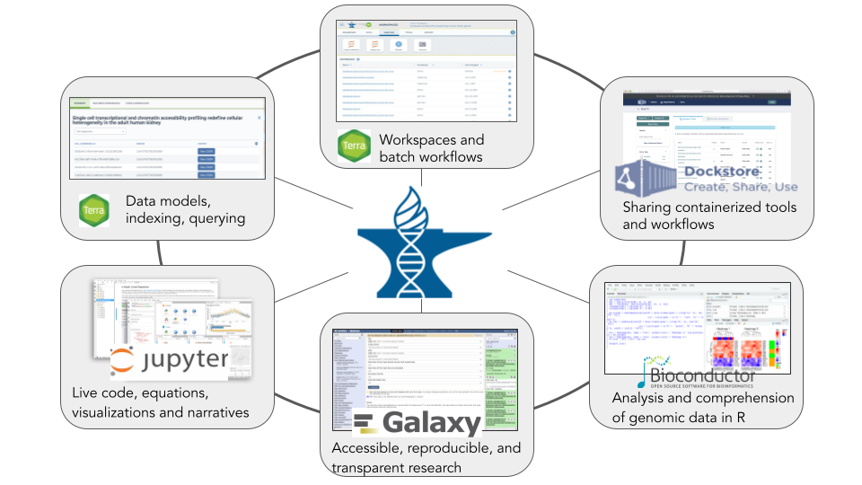
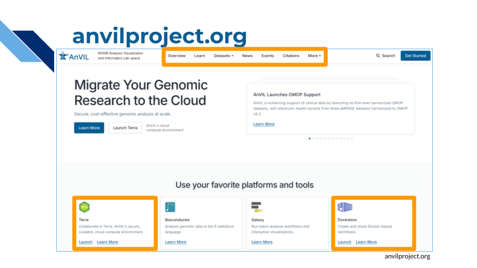
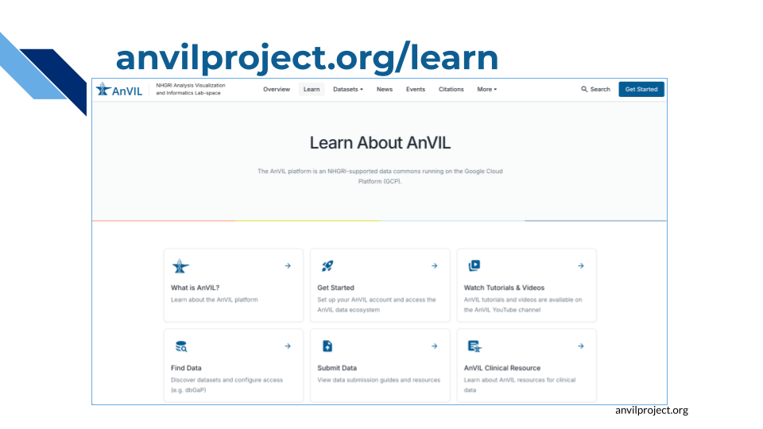
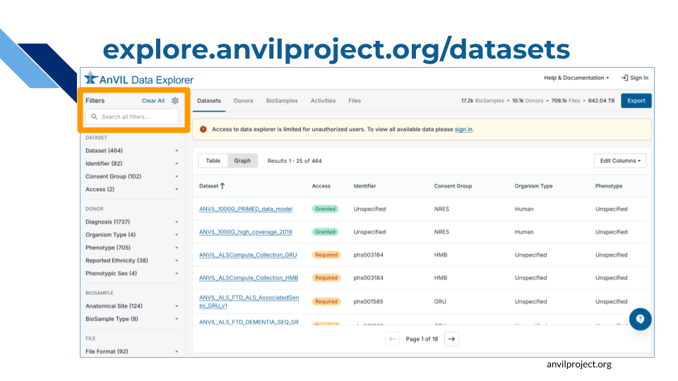
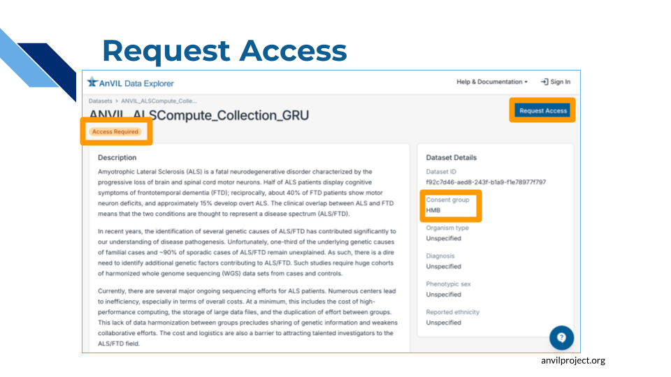
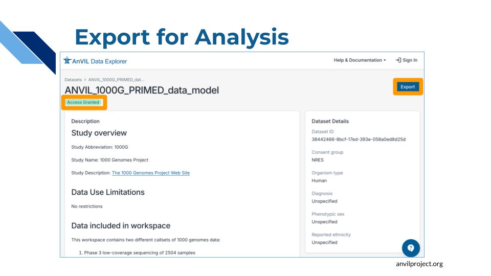
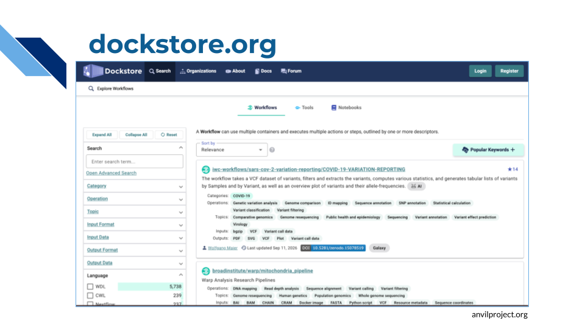
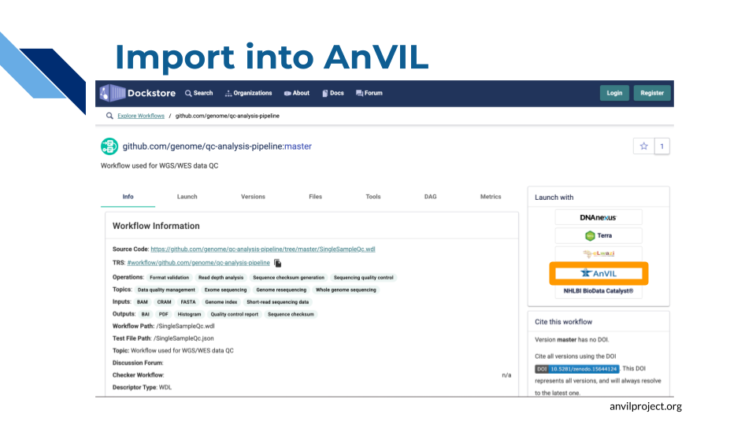
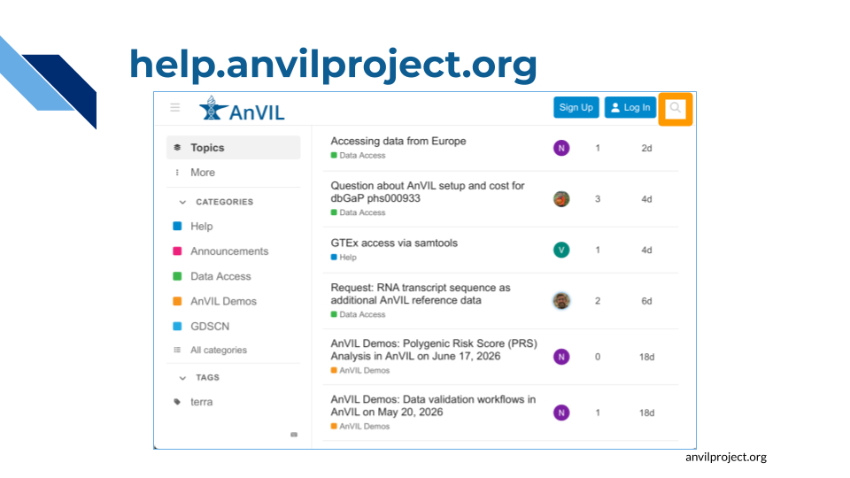

# Tour of AnVIL

## Introduction

AnVIL consists of several different pieces that work together to provide researchers with the things they need to carry out their analyses.

It can be easy to start thinking of AnVIL as just the computing platform (Terra), and that is indeed where you will spend the majority of your time. But AnVIL also includes:

- The AnVIL Data Catalog, providing secure access to a large collection of high-interest genomic datasets, along with the [AnVIL Data Explorer](https://explore.anvilproject.org/datasets) to help you find and import these datasets into your own research.
- [Dockstore](https://dockstore.org/) for finding and sharing analysis pipelines, which can be imported into AnVIL with the click of a button.
- The [community support forum](https://help.anvilproject.org/), where you can interact with other AnVIL users as well as members of the AnVIL team to find help and hear about what people are doing on AnVIL.
- The [AnVIL Portal](https://anvilproject.org/), AnVIL’s primary website, containing documentation and FAQS, announcements about new features and datasets, upcoming events, and more.

In this chapter we will take a brief tour of the broader AnVIL ecosystem, showing you how to access these resources, before diving into the Terra interface.

## The AnVIL Ecosystem

### AnVIL Portal

The AnVIL Portal ([anvilproject.org](https://anvilproject.org/)) is the central hub of the AnVIL ecosystem. Here you can find links to the many components of AnVIL, as well as documentation and important announcements.

We’ve highlighted a few items that may be useful to you:

- Click on the cards to access important AnVIL tools including Terra and Dockstore, which we will discuss in more detail below.
- Check the menu at the top of the page:
  - **Learn** contains documentation and tutorials
  - **AnVIL Data Explorer** lets you find and access datasets hosted by AnVIL

At [anvilproject.org/learn](http://anvilproject.org/learn), you can find documentation and tutorials for many of AnVIL’s features.

:::{.reflection}
TODO
:::

### Data Explorer

The AnVIL Data Explorer ([explore.anvilproject.org/datasets](https://explore.anvilproject.org/datasets)) lets you browse the datasets that are available on AnVIL and import them into Terra for analysis with the click of a button.

Search by name to find specific datasets, or filter by a variety of facets such as, Diagnosis, Phenotype, or Consent Group.

Click on a dataset name for more detailed information.

AnVIL hosts many controlled-access datasets, which are tagged "Access Required". Click on the "Request Access" button to apply for access. You can find more information in the documentation on [Requesting Data Access](https://anvilproject.org/learn/find-data/requesting-data-access).

For data which you have permission to access, click on the "Export" button to see options for working with the data, including sending it to Terra for analysis or downloading it to your local machine.

:::{.reflection}
How many open-access datasets are available on AnVIL?

  
Hint 

  Filter for Access:Granted

Search for [TODO]
:::

You can find more information about working with data on AnVIL at:

- [AnVIL Data Explorer Guide](https://explore.anvilproject.org/guides)
- AnVIL documentation on [Finding Data](https://anvilproject.org/learn/find-data)
- [Data on AnVIL](https://hutchdatascience.org/Data_on_AnVIL/) webbook

### Dockstore

[Dockstore](https://dockstore.org/) provides a catalog of thousands of reusable workflows which can be used across different platforms, including AnVIL. AnVIL supports workflows written in **Workflow Description Language (WDL)**.

You can search for workflows by name, author, or organization, among other features.

Click on the name of a workflow to view more details.

From here you can import the workflow into AnVIL with the click of a button.

:::{.reflection}
TODO
:::

You can find more information about running workflows on AnVIL in the AnVIL documentation on [Running Analysis Workflows](https://anvilproject.org/learn/run-analyses-workflows).

### Support Forum

Through the [AnVIL community forum](https://help.anvilproject.org/) you can find help and interact with the AnVIL team and the broader AnVIL community. Members of the AnVIL team regularly monitor the forum and respond to questions.

Try searching to see if anyone else has had the same question, or post a new topic so that others can benefit from seeing how your question was resolved.

:::{.reflection}
TODO
:::

## Terra

We end this chapter with a brief video tour of Terra, AnVIL’s cloud computing platform. In the next chapter, you’ll dive deeper with a hands-on walkthrough.

(This video is a recording from our live AnVIL 101 workshop. It should automatically jump to touring a Terra Workspace, but in case it doesn't, the relevant segment runs from 37:15-51:45)

<iframe width="800" height="250" src="https://www.youtube.com/embed/LKoOEpA8NMk?si=2q7T_GGb8UUrYX3m&amp;start=2235&amp;end=3104" title="YouTube video player" frameborder="0" allow="accelerometer; autoplay; clipboard-write; encrypted-media; gyroscope; picture-in-picture; web-share" referrerpolicy="strict-origin-when-cross-origin" allowfullscreen></iframe>

